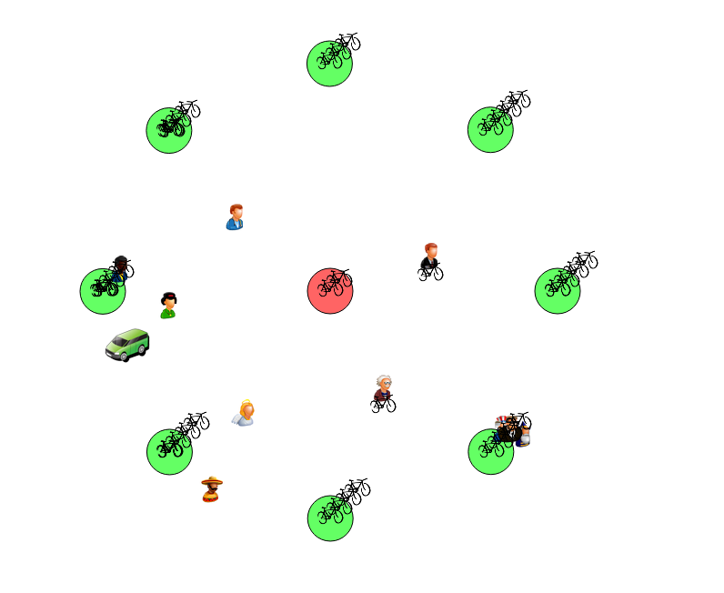

# PCO25 LAB05

## Autheur : Mauros Santos, Gabriel Bader

## Overview

Ce projet consiste à modéliser et implémenter un système de gestion de vélos en libre-service dans une ville, en utilisant des moniteurs de Mesa

### Découpage

La modélisation de ce projet ce fait comme ceci :

- Les Bike Stations (bikeStation.h/cpp)

Elements clé de cette simulation, chaque bikeStation va avoir la logique derriere le stockage et la "location" de vélo. C'est donc ici que les gens et le van vont se retrouver en simultané pour faire leurs actions.
On va voir plus tard que c'est ici que notre class implémente un moniteur de Mesa afin de garantir l'accès concurant.

Les bikeStations doivent garantir "premier arrivé, premier servis" (FIFO). Voir section, système de ticketing.

- Les personnes (person.h/cpp)

Ce sont les utilisateurs du système. Ils vont suivre leur routine et 'louer' le vélo qui leur correspond.
Leur routine est détérminée par :
```pseudocode
Boucle infinie
1. Attendre qu’un vélo du site i devienne disponible et le prendre.
2. Aller au site j̸ = i.
3. Attendre qu’une borne du site j devienne libre et libérer son vélo.
4. Faire une activité à pied pour se rendre à un autre site k.
5. i ← k
Fin de la boucle
```

- Le van (van.h/cpp)

C'est l'utilitaire de cette simulation. Il aura pour role de restock les bikeStation et de réatribuer les vélos entre bikeStation afin de garder un bon équilibre de nombre de vélo.

Il a aussi sont comportement décris par :

```pseudo code
Boucle infinie
1. Mettre a = min(2, D) vélos dans la camionnette.
    2. Pour i = 1 à S faire
        2a. Si Vi > B − 2 alors
        Prendre c = min Vi − (B − 2), 4 − a vélos du site i et les mettre dans la camionnette.
        a ← a + c.
    2b. Si Vi < B − 2 alors
        Calculer c = min (B − 2) − Vi, a (nombre de vélos à déposer au site i).
        Initialiser cdéposés ← 0.
        Pour chaque type de vélo t
            Si le site i ne contient aucun vélo de type t
            et la camionnette contient au moins un vélo de type t alors
            Déplacer un vélo de type t de la camionnette vers le site i.
            a ← a − 1, Vi ← Vi + 1, cdéposés ← cdéposés + 1.
            Si cdéposés = c alors sortir de la boucle sur les types.
        Tant que cdéposés < c et a > 0 faire
        Déplacer un vélo quelconque de la camionnette vers le site i.
        a ← a − 1, Vi ← Vi + 1, cdéposés ← cdéposés + 1.
3. Vider la camionnette au dépôt : D ← D + a, a ← 0.
4. Faire une pause.
Fin de la boucle
```


On a ici une image qui représente la simulation. Il y'a le van en vert, les différentes personnes qui comment dit précedamment, on leur routine,




# Choix de conceptions
## BikeStation

### Moniteur de Mesa

Il nous à été demandé spécifiquement d'utiliser un moniteur de Mesa dans ce laboratoire mais il peut être intéressant de se demander pourquoi.

L'utilisation des bikeStations par de multiples threads (personne et van) en même temps fait que nous devons faire attention à la concurrence. Ceci étant dit, 
nous avons besoins de variables de conditions afin de signaler aux thread plusieurs cas (par exemple : un vélo à été posé dans la bikeStation).
Mesa s'intégre particulièrement bien à notre labo aussi par le fait que nous faisons des files d'attente, et lorsqu'une de nos conditions sont satisfaites, on peut prévnir le bon thread.


Présentation de la classe BikeStation :

``` c++
class BikeStation
{
public:
    /**
     * @brief Mutex that secure the critical section
     */
    PcoMutex mutex;

    /**
     * @brief condition of hasVTT - notify when there is a VTT available
     */
    PcoConditionVariable hasVTT;

    /**
     * @brief condition of hasRoad - notify when there is a Road available
     */
    PcoConditionVariable hasRoad;
    /**
    * @brief condition of hasRoad - notify when there is a hasGravel available
    */
    PcoConditionVariable hasGravel;
    
    /**
    * @brief condition if bikeStation is not full.
    */
    PcoConditionVariable isntFull;

    /** TICKET SYSTEM ------
    * @brief tab for each type of bike. Each index is the ticket system for the type of bike
    * Exemple: getTickets[0] -> we get the next size_t of the ticket system.
    */
    size_t getTickets[Bike::nbBikeTypes] = {0,0,0};

    /**
    * @brief get the next ticket
    */
    size_t getNext[Bike::nbBikeTypes] = {0,0,0};

    /**
    * @brief it is the the turn of a person, 'use' his ticket and put his bike
    */
    unsigned int putTicket = 0;

    /**
    * @brief get the next person turn.
    */
    unsigned int putNext = 0;
    
    // ........
    // .......
    
private:
    /**
    * @brief when emergency stop, check this condition to return the right way
    */
    bool ended = false;


```

Avec l'explication de chaque attributs ci-dessous :

### Système de ticketing

Comme dit précédamment, on gère dans cette simulation un ordre FIFO pour les utilisateurs. Pour ce faire, on à :

- size_t getTickets[Bike::nbBikeTypes] = {0,0,0}; 
- size_t getNext[Bike::nbBikeTypes] = {0,0,0}; 
- unsigned int putTicket = 0;
- unsigned int putNext = 0;

L'utilisation en général est la suivante :

Lorsqu'un utilisateur souhaite déposer ou prendre un vélo, il va se mettre dans la file d'attente qui correspond à son action et à sa préférence de vélo.

Ensuite, il va se mettre en attente sur plusieurs conditions (par exemple : il y a pas le velo demandé ou il n'y a pas de place dans la bikestation).

Et enfin, il va se faire reveiller, et si c'est sont tour (donc le bon numéro de ticket), il va pouvoir prendre le vélo.

#### Mutex

Notre mutex est notre protection qui permetre de gérér l'accès concurant. Plus précisement on va protéger l'accès de :

- std::vector<Bike*> bikes;
- const size_t capacity;

`bikes` : est un vecteur de bike, qui va stocker les vélos actuellement à la bike station. On va donc devoir protéger tout les accès en lecture/écriture afin de garantir l'intégrité de ce tableau. Par exemple, lorsqu'on veut prendre un vélo, il ne faut pas que ce vélo soit déja pris par un autre thread.


Et nos variables et fonctions du système de ticketing :

- size_t getTickets[Bike::nbBikeTypes] = {0,0,0};
- size_t getNext[Bike::nbBikeTypes] = {0,0,0};
- unsigned int putNext = 0;
- unsigned int putTicket = 0;


#### PcoConditionVariable

Nous avons décider de faire 3 variables différentes qui représente chaque type de vélo. 
L'objectif étant de séparer les personnes en 3 files d'attente différentes en fonction du vélo qu'elles veulent.
Nous permettant du coup de faire avancer les files d'attentes indépendament les unes des autres. C'est à dire si la bikeStation est en manque de VTT, les deux autres files d'attentes (route et gravel) peuvent continuer à avancer.

Donc on a :

- PcoConditionVariable hasVTT
- PcoConditionVariable hasRoad;
- PcoConditionVariable hasGravel;

Qui définissent chaque catégorie de vélo, et donc qu'on appel en fonction des disponibilités.

et aussi:

- PcoConditionVariable isntFull;

Qui va permettre de savoir quand une bikeStation n'est plus full. Cela permet de reveiller les thread en attente de poser un vélo.

#### bool ended

Cette variable est un flag qui nous permet de savoir lorsque nous voulons stoper la simulation de prévenir tout les threads et de les arreters correctement.


# Utilisation de la BikeStation par le Van

Cette partie va expliquer l'utilisation de la bikeStation et amener des compléments surtout sur 'Van' et ses interactions avec la partie critque et l'accès aux sections partagée.

## Van

Le van utilise aussi les bikeStation pour déposer et prendre des vélos. Il utilise donc les fonctions publiques de la bikeStation(getBikes et addBikes).
Nous avons choisi de lock et unlock le mutex de la bikeStation directement dans le van avant d'appeler les fonctions de la bikeStation. Ceci est necessaire pour d'assurer l'etat de bikestation entre la vérification du stock de la bikestation et le restock, (par exemple une personne qui prend un vélo).

## Personne

Les personnes utilisent majoritairement les fonctions getBike et putBike. Le mutex est donc lock et unlock dans ces fonctions la directement.

# Tests unitaires

Nous avons essayer de faire des tests unitaires pour ce labo afin de s'assurer l'intégrité du programme, mais à cause de conflit avec Qt et des libraires nous n'arrivons pas à compiler. Nous avons tenter de demander aux autres groupes, ils ont le même problème. Bien que tardif, nous avons tenté aussi de vous joindre sur Teams pour ce problème.

Mais dans le cas ou cela compilerait, on aurait fait de multiples tests testants tout les accès concurant, notre logique de perssone et du van, et bien d'autre.

# Utilisation de l'IA

Aucune utilisation de l'IA pour ce projet.


# Conclusion

Ce labo était très intéressant et surtout par le fait d'avoir utiliser un Moniteur de Mesa. On ressent que d'avoir faire un peu d'abstration par rapport aux sémaphore et autre, en utilisant une classe, c'est vraiment cool.
